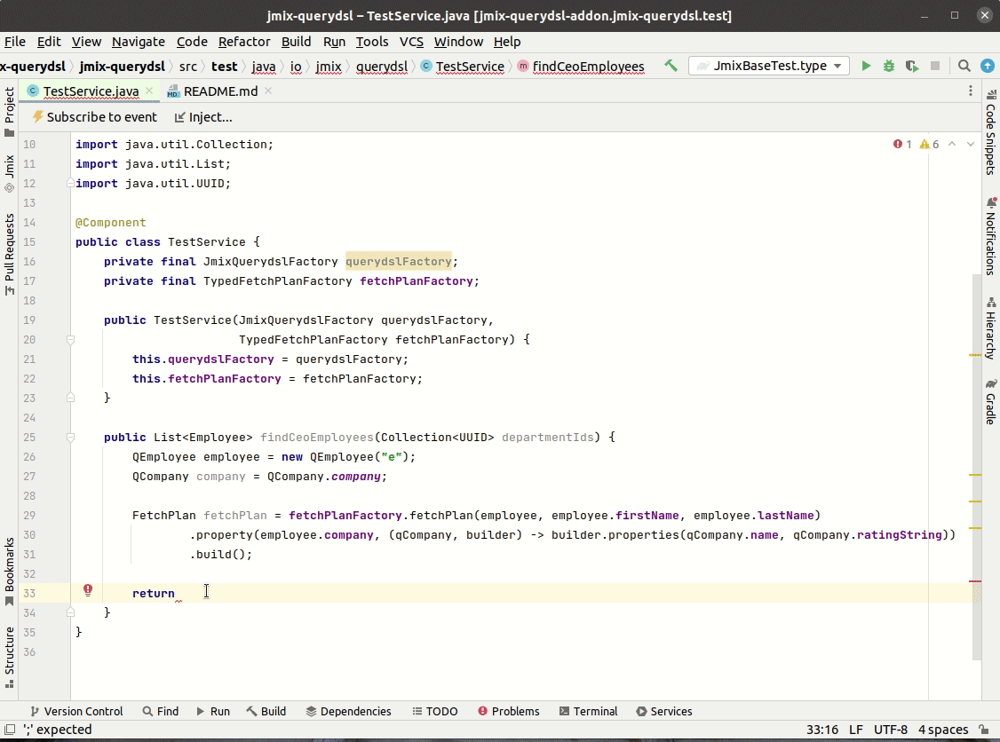

## QueryDSL Add-on

### Overview

The add-on provides:
- [QueryDSL](http://www.querydsl.com/) integration for Jmix applications. [QueryDSL](http://www.querydsl.com/) enables the construction of unified type-safe database queries for Java. Instead of writing queries, you can use a fluent API.
- FetchPlan Builder based on QueryDSL classes

See test classes of io.jmix.querydsl.JmixBaseTest from the project, using this add-on.

#### Suggestions in IDE

QueryDSL provides suggestions in your IDE:

- while writing queries in your Jmix application
  

- while writing FetchPLan in you Jmix application

#### Compilation

QueryDSL guarantees that the compiler will check that your database queries and Jmix FetchPlan are type-safe. It also helps you adapt better to refactoring changes.


### Installation
1. Add to your module with JPA entities in the `build.gradle` dependencies:
 ```groovy
dependencies {
    // begin: add by yourself
    implementation 'io.jmix:jmix-querydsl-starter:0.0.3'
    annotationProcessor configurations.implementation
    // end: add by yourself
}
```

2. Assemble the project. This part is needed to generate QueryDSL classes.

Now you can use type-safe queries and typed FetchPlans in your Jmix application.

### Examples

Here are usage examples:

Query example
```java
//inject JmixQuerydslFactory bean
@Autowired
private JmixQuerydslFactory querydslFactory;

//usage
QOrder order = new QOrder("o");
QOrderStorageItem orderStorageItem = QOrderStorageItem.orderStorageItem;

return querydslFactory.select(order)
        .from(orderStorageItem).join(orderStorageItem.order, order)
        .where(orderStorageItem.storage.id.eq(storageId.getValue()))
        .orderBy(order.updateTs.desc())
        .fetch(fetchPlan);
```

Projection example
```java
//Projection class with annotated constructor as `@QueryProjection` 
public class CatBrowse {
    private final String name;
    private final Date birthdate;
    private final Integer breed;

    @QueryProjection
    public CatBrowse(String name, Date birthdate, Integer breed) {
        this.name = name;
        this.birthdate = birthdate;
        this.breed = breed;
    }
//getter/setters...
    
//usage    
List<CatBrowse> cats = querydslFactory.from(cat)
        .select(new QCatBrowse(cat.name, cat.birthdate, cat.breed))
        .where(cat.name.eq("Bob123")).fetch();
```

Tuple example
```java
List<Tuple> tuples = querydslFactory.from(cat).select(cat.name, cat).fetch();
assertFalse(tuples.isEmpty());
for (Tuple tuple : tuples) {
    assertNotNull(tuple.get(cat.name));
    assertNotNull(tuple.get(cat));
}
```

Integration with JmixDataRepository example. 
The spring-data project has `org.springframework.data.querydsl.QuerydslPredicateExecutor` interface for integration with Spring Data Repository.
At the moment, the jmix-querydsl add-on does not have an implementation for `QuerydslPredicateExecutor` interface.
jmix-querydsl add-on provides `io.jmix.querydsl.repository.JmixQuerydslExecutor` interface (and implementation: `io.jmix.querydsl.impl.JmixQuerydslExecutorImpl`) for integration with `io.jmix.core.repository.JmixDataRepository`.
This approach is based on C# [Entity Framework Querying](https://learn.microsoft.com/en-us/ef/core/querying/).

```java
//Enable JmixDataRepositories and override repositoryFactoryBeanClass to `io.jmix.querydsl.repository.JmixQuerydslRepositoryFactoryBean`
@SpringBootConfiguration
@EnableAutoConfiguration
@JmixModule(id = "io.jmix.querydsl.test", dependsOn = JmixQuerydslConfiguration.class)
@EnableJmixDataRepositories(value = "io.jmix.querydsl",
        repositoryFactoryBeanClass = JmixQuerydslRepositoryFactoryBean.class)
public class JmixQuerydslTestConfiguration {
```

```java
//Repository class implemented `JmixDataRepository` and `JmixQuerydslExecutor`. 
public interface CatRepository extends JmixDataRepository<Cat, UUID>, JmixQuerydslExecutor<Cat> { }

//inject repository bean
@Autowired
private CatRepository catRepository;

//method `select()` invoked  JmixQuerydslFactory.from(entityPath).select(entityPath). See implementation in io.jmix.querydsl.repository.impl.JmixQuerydslExecutorImpl
List<Cat> result = catRepository.select()
        .where(cat.name.eq(select(other.name).from(other)
                .where(other.name.indexOf("B").eq(0))))
        .fetch();

//method select(Expression<U> expr) invoked JmixQuerydslFactory.from(entityPath).select(expr)
List<CatBrowse> cats = catRepository
        .select(new QCatBrowse(cat.name, cat.birthdate, cat.breed))
        .where(cat.name.eq("Bob123"))
        .fetch();

//method select(Expression<?>... exprs) invoked JmixQuerydslFactory.from(entityPath).select(exprs)
List<Tuple> cats = catRepository
        .select(cat.name, cat.birthdate, cat.breed)
        .where(cat.name.eq("Bob123"))
        .fetch();
```

FetchPlan example
```java
@Inject
protected TypedFetchPlanFactory fetchPlanFactory;
var qStorage = QStorage.storage;

FetchPlan storageFetchPlan = fetchPlanFactory.fetchPlan(qStorage, qStorage.name)
       .property(qStorage.storageItems, (qsi, qsib) -> qsib.properties(qsi.count)
               .property(qsi.product, (qp, qpb) -> qpb.properties(qp.name))).build();

```

### Unsupported standard Querydsl functionality in Jmix Querydsl implementation
- Result aggregation via `com.querydsl.core.FetchableQuery.transform`. See tests: `AbstractJmixTest.groupBy`, `AbstractJmixTest.transform_groupBy`, `AbstractJmixTest.transform_groupBy2`, `AbstractJmixTest.transform_groupBy_alias`
- select by com.querydsl.jpa.JPAExpressions.type. See test: `AbstractJmixTest.type`
- Arithmetic operations for date types See tests: `AbstractJmixTest.case1_date`, `AbstractJmixTest.case1_date`, `AbstractJmixTest.case1_time2`
- Tuple with cast to string function. See test: `AbstractJmixTest.cast_toString`
- Contains by entity. See test: `AbstractJmixTest.contains2`
- In by range values. See test: `AbstractJmixTest.in4`
- Not implemented `org.springframework.data.querydsl.QuerydslPredicateExecutor` interface 
### Jmix entity enhancements unsupported 
- Entity attribute basic types (int, short, long, byte, etc...)
- Element collections
- Maps
- Joda time